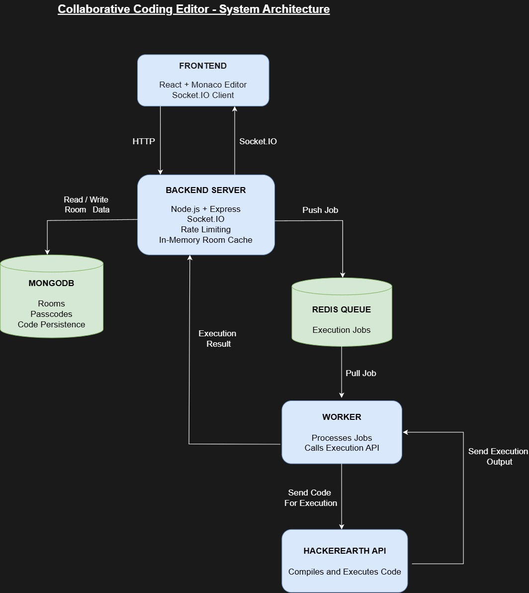

# Real-Time Collaborative Code Editor

A real-time collaborative code editor where multiple users can join the same room and write code together.

I built this project to understand how real-time applications work and to explore how they can be made more scalable, reliable, and efficient. While building it, I worked on problems such as synchronizing code between users, handling multiple browser tabs and temporary network disconnections, reducing latency and unnecessary network traffic, minimizing database operations through caching, protecting the server with rate limiting, and handling code execution using a queue and worker.

The editor also includes a **Run Code** feature that allows users to execute their code and view the output directly inside the application.

## Live Demo

[Try the Live Application](https://collaborative-coding-editor-queue.vercel.app/)

---

## Features

- Real-time collaborative code editing
- Multiple isolated rooms
- Passcode-protected rooms
- Run code and view output
- Persistent rooms using MongoDB
- Unique room IDs
- Active users panel
- User join and leave notifications
- Shows the line each user is currently working on
- Handles multiple tabs opened by the same user
- Handles page refreshes without treating the same user as a new user
- Handles temporary network disconnections
- Debounced code updates
- In-memory caching for active rooms
- Rate limiting
- Redis-backed job queue
- Worker-based code execution workflow

---

## Tech Stack

### Frontend

- React
- Vite
- Monaco Editor
- Socket.IO Client

### Backend

- Node.js
- Express.js
- Socket.IO

### Database and Infrastructure

- MongoDB
- Redis
- HackerEarth Code Evaluation API

---

## How It Works

### Real-Time Collaboration

Users can create a room and share the room ID and passcode with others.

When users join the same room, their code is synchronized in real time using Socket.IO. Updates are only sent to users inside that particular room, so different rooms remain completely isolated from each other.

### Debounced Code Updates

Initially, sending every keystroke to the server would create a large number of unnecessary socket events.

To reduce this, I added a **300 ms debounce** to code updates. The latest code is sent only after the user pauses typing for 300 ms.

This reduces unnecessary network traffic and server load while still keeping collaboration responsive.

### Multi-Tab and Refresh Handling

One problem with WebSockets is that every browser tab creates its own socket connection.

For example, if the same user opens a room in three tabs:

```text
User
├── Socket 1
├── Socket 2
└── Socket 3
```

Closing one tab should not make the user appear offline if the other two tabs are still connected.

To handle this, I map each user to a set of their active socket IDs. A user is removed from the room only when all of their socket connections have disconnected.

This also handles page refreshes, where the old socket disconnects and a new socket connection is created. By identifying users with a persistent user ID instead of their socket ID, a refresh does not make the same user appear as if they left the room and joined again as a new user.

### Temporary Network Disconnections

A temporary internet problem should not immediately remove a user from the room.

When a socket disconnects, I wait for a short grace period before removing the user. If the user reconnects during that period, the new socket connection is associated with the same user and they continue normally.

This helps handle temporary internet loss, unstable connections, and page refreshes without unnecessary join and leave events.

### User Presence

The users panel shows everyone currently present in the room.

It also shows the line each user is currently working on, making it easier to understand where other participants are editing.

Users are also notified when someone joins or leaves the room.

### MongoDB Persistence

Rooms are stored in MongoDB so that they are not lost when the server restarts.

Each room stores:

- Room ID
- Passcode
- Latest code

Room IDs are also kept unique at the database level, preventing two rooms from being created with the same ID.

### In-Memory Caching

For active rooms, repeatedly querying MongoDB for the same data is unnecessary.

I added an in-memory cache so that once an active room has been loaded from the database, other users joining that room can access the cached data directly. Since the data is served directly from memory instead of requiring another database query, this helps reduce latency and provides faster access to frequently used room data.

Code changes are also kept in the cache and synchronized with the database instead of writing to the database on every keystroke.

When the room becomes inactive, the latest code is saved to MongoDB and the room is removed from memory so that unused rooms do not keep consuming RAM.

### Rate Limiting

Rate limiting is used to prevent a single user from creating unnecessary load on the server.

Limits are applied to operations such as:

- Creating rooms
- Joining rooms
- Running code

For example, a user cannot repeatedly create or join a large number of rooms within a short period of time or continuously spam the **Run Code** feature.

### Code Execution

The editor includes a **Run Code** feature that allows users to execute code and view the output directly inside the application.

Instead of making the main server handle every execution request immediately, code execution requests are added to a Redis-backed queue.

The execution flow is:

```text
User clicks Run
        ↓
Backend receives the request
        ↓
Job is added to the Redis queue
        ↓
Worker picks up the job
        ↓
Worker sends the code to the HackerEarth API
        ↓
HackerEarth compiles and executes the code
        ↓
Execution output is returned to the worker
        ↓
Result is sent back to the user
```

This keeps the code execution workflow separate from the main real-time collaboration logic.

### Queue and Worker

If many users click **Run Code** at the same time, immediately processing every request can put unnecessary load on the application.

To handle this, I use Redis as a queue. Execution requests wait in the queue and are processed by a worker.

The main server can therefore continue handling:

- Real-time code synchronization
- Room creation and joining
- User presence
- Socket connections

while the worker processes queued execution jobs and communicates with the external code execution API.

Using Redis for the queue also means queued jobs are not stored only inside the main Node.js server's memory.

---

## Architecture



The application separates real-time collaboration, persistent storage, and asynchronous code execution.

- The **frontend** communicates with the backend through HTTP and Socket.IO.
- The **backend server** handles rooms, real-time communication, rate limiting, and the in-memory room cache.
- **MongoDB** provides persistent storage for room data.
- **Redis** stores queued code execution jobs.
- The **worker** pulls jobs from the queue and communicates with the HackerEarth Code Evaluation API.
- The execution result is returned through the worker and backend to the user.

---

## What I Learned

This project helped me understand several problems that appear when building real-time applications.

Some of the main things I learned were:

- Managing multiple WebSocket connections for the same user
- Keeping users synchronized across multiple rooms
- Handling temporary disconnections and reconnections
- Reducing unnecessary socket events using debouncing
- Reducing database operations using caching
- Persisting room state using MongoDB
- Preventing abuse using rate limiting
- Using Redis as a queue
- Moving background work to a worker
- Separating real-time communication from heavier asynchronous tasks

---

## Future Improvements

Some improvements I would like to explore in the future:

- Horizontal scaling with multiple Socket.IO servers
- Authentication and user accounts
- Room ownership and roles
- Better conflict resolution for simultaneous edits
- Collaborative cursors and selections

---

## Running the Project Locally

### Prerequisites

Make sure you have the following installed:

- Node.js
- MongoDB
- Redis

### Clone the Repository

```bash
git clone https://github.com/Harsh-Singh4/Live-Coding-Editor.git
cd Live-Coding-Editor
```

### Install Backend Dependencies

```bash
cd Backend
npm install
```

Create a `.env` file and add the required environment variables:

```env
MONGO_URI=your_mongodb_connection_string
REDIS_URL=your_redis_connection_string
```

Then start the backend:

```bash
npm run dev
```

### Start the Frontend

Open another terminal:

```bash
cd Frontend
npm install
npm run dev
```

---
